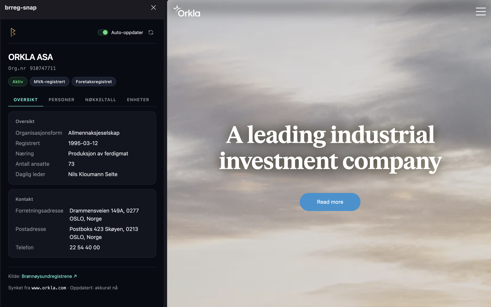

# brreg-snap

Browser extension (Firefox + Chrome/Chromium) that surfaces Norwegian
company information from [Brønnøysundregistrene](https://data.brreg.no/)
— CEO, board members, signaturrett, status flags, key figures —
straight from the toolbar.

Click the icon while on a company website, get the brreg snapshot in a
popup. No content scripts, no page DOM access, no third-party calls.

> One source tree, two targets. Firefox is live on AMO; the Chrome
> build is feature-complete bar the tab-switch auto-update (a follow-up)
> and pending Chrome Web Store submission — see
> [docs/chrome-port.md](docs/chrome-port.md). The engine differences
> (sidebar vs. side panel, `menus` vs. `contextMenus`, event page vs.
> service worker) are isolated in `src/lib/platform/` behind a runtime
> feature check, with **no third-party polyfill** — the zero-runtime-
> dependency guarantee holds on both engines.



## Security model

Popup-only architecture. The extension never injects code into the
pages you browse and never reads their DOM.

| Permission | Why |
|---|---|
| `activeTab` | Read URL + title of the current tab **only when you click the icon, the sidebar icon, or a context-menu item** |
| `storage` | Cache brreg responses locally (`storage.session`, 24h TTL) and persist the "Auto-oppdater" toggle (`storage.local`) |
| `menus` | Register the "Vis i brreg-snap sidebar" right-click item. On Mozilla's no-prompt list — silent at install, does not grant tab snooping (activeTab still required, granted per click). |
| `host_permissions: https://data.brreg.no/*` | Fetch from the public brreg API. Only domain we contact. |
| `optional_permissions: tabs` | **Off by default.** Required only if the user opts into "Auto-oppdater ved fane-bytte" in the sidebar. Requested at runtime via a Firefox prompt; revocable from `about:addons` or by flipping the toggle off (which calls `permissions.remove`). Install dialog stays silent. |

On Chrome the equivalent install set is `activeTab` + `storage` +
`contextMenus` + `sidePanel` + the same `data.brreg.no` host — all on
Chrome's no-prompt list. The Chrome MVP omits `tabs`/auto-sync
entirely (deferred to a follow-up), so its install footprint is even
narrower than Firefox's.

What this rules out:

- No `<all_urls>` host permission
- No content scripts
- No `eval` or remote-loaded code
- No third-party analytics or telemetry
- No DOM access on the pages you visit

The optional `tabs` permission grants nothing by itself: the extension
only reads `tab.url` and `tab.title` on switch/update events to resolve
an org-number, and only while the user-facing toggle is on. There is
no `cookies`, `webRequest`, or `<all_urls>` access — the security
posture stays "no DOM, no network beyond data.brreg.no".

Total reviewable surface is intentionally small (~200 LOC core).

## Install — development

Requires Node 18+, [pnpm](https://pnpm.io/) 10.33+, and Firefox and/or
Chrome.

```bash
pnpm install
pnpm dev             # builds + launches a Firefox dev profile with the extension loaded
pnpm dev:chrome      # builds the Chrome target + web-ext run -t chromium
```

To produce distributable packages:

```bash
pnpm package          # Firefox -> web-ext-artifacts/brreg-snap-X.Y.Z.zip (.xpi)
pnpm package:chrome   # Chrome  -> web-ext-artifacts/brreg-snap-chrome-X.Y.Z.zip
```

**Firefox:** load the `.xpi` via `about:debugging` → "This Firefox" →
"Load Temporary Add-on". For permanent install you need the AMO-signed
build (see [Distribution](#distribution)).

**Chrome:** `pnpm build:chrome`, then `chrome://extensions` → enable
"Developer mode" → "Load unpacked" → select `dist-chrome/`.

## How it works

When you click the toolbar icon:

1. Popup opens and reads the current tab's URL + title (`activeTab`).
2. Extract an organisation number using:
   - **Org-nr regex** — 9-digit pattern in URL path/query or title
   - **Hostname → brreg search** — multi-query pipeline (hjemmeside
     field + Nordic-folded name search) with confidence scoring
     (`src/lib/hostname-search.ts`, `src/lib/hostname-score.ts`).
     Auto-resolves only when one candidate is clearly ahead; the
     sidebar surfaces a "Mente du …?" picker when several plausible
     companies tie, and refuses rather than guess wrong.
   - **Free-text search fallback** — if nothing else matches, the
     popup shows a search box that hits brreg's search endpoint.
3. Fetch the entity from `data.brreg.no/enhetsregisteret/api/enheter/<orgnr>`.
4. Render the result in the popup. Nothing else is touched.

Responses are cached in `storage.session` for 24 hours, so repeated
lookups don't hammer the API.

A sidebar panel (toolbar sidebar icon or "Vis i brreg-snap sidebar"
from the page right-click menu) renders the same data with a deeper
layout — board members, signaturrett, regnskap, underenheter. With
"Auto-oppdater ved fane-bytte" enabled the sidebar requests the
`tabs` permission at runtime and re-resolves the orgnr whenever you
switch tabs.

## Project layout

```
src/
  background/                 FF event page / Chrome service worker; context menu + tab listeners
  popup/                      popup.html + popup.ts + popup.css (toolbar action)
  details/                    detail panel (FF sidebar_action / Chrome side_panel)
  lib/
    platform/
      globals.ts              aliases globalThis.browser = chrome on Chromium (no polyfill)
      engine.ts               isFirefox feature detection
      sidebar.ts              sidebarAction (FF) vs sidePanel (Chrome) adapter
    auto-sync-controller.ts   pure decision logic for the auto-sync toggle
    auto-sync-settings.ts     storage.local persistence for the toggle
    brreg.ts                  data.brreg.no API client
    copy-orgnr.ts             click-to-copy helper for orgnr digits
    format.ts                 display formatters (addresses, etc.)
    hostname-score.ts         pure scoring + 3-band decision for hostname matches
    hostname-search.ts        multi-query brreg pipeline + picker-choice cache
    mod11.ts                  mod-11 checksum (zero-dep, shared by orgnr.ts and details.ts)
    orgnr.ts                  URL/title → orgnr extraction
    roller.ts                 board-role normalisation
    tab-sync.ts               {type:'sync', orgnr, host} broadcast helper
  types/
    brreg.ts                  response type definitions
public/
  manifest.firefox.json       Firefox MV3 manifest (sidebar_action, menus, gecko settings)
  manifest.chrome.json        Chrome MV3 manifest (side_panel, service_worker, contextMenus)
  icons/                      toolbar icon set
tests/
  *.test.ts                   Vitest unit tests
```

## Distribution

- **[addons.mozilla.org](https://addons.mozilla.org/firefox/addon/brreg-snap/)**
  — primary distribution. Auto-updates via Firefox.
- **[GitHub releases](https://github.com/ikkeseb/brreg-snap/releases)**
  — signed `.xpi` available as a backup for users who prefer
  side-loading. Manual updates only.

For AMO reviewers: see [BUILD.md](BUILD.md) for reproducible build
instructions.

## Privacy

The extension only contacts `data.brreg.no` (the public API of the
Norwegian Brønnøysund Register Centre). No content scripts, no
third-party calls, no analytics, no telemetry. See
[PRIVACY.md](PRIVACY.md) for the full data flow, what is stored
locally, and what permissions are used for.

## Contributing

Open an issue first for non-trivial changes. The popup-only security
model is non-negotiable — PRs that add content scripts, third-party
hosts, or relax CSP will be closed.

## License

[MIT](LICENSE).
