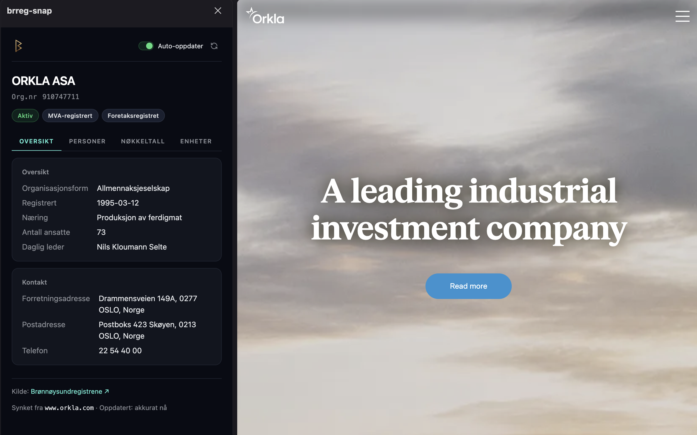

# brreg-snap

Browser extension (Firefox + Chrome/Chromium) that surfaces Norwegian
company information from [Brønnøysundregistrene](https://data.brreg.no/)
— status, CEO, board members, key figures and accounts — straight from
the toolbar.

Click the icon while on a company website, get the brreg snapshot in a
popup. No content scripts, no page DOM access, and the only server it
talks to is the public registry API.

> One source tree, two targets, both live: Firefox on
> [AMO](https://addons.mozilla.org/firefox/addon/brreg-snap/), Chrome
> on the Chrome Web Store (since 2026-06-07) — at full feature parity,
> including the optional tab-switch auto-update — see
> [docs/chrome-port.md](docs/chrome-port.md). The engine differences
> (sidebar vs. side panel, `menus` vs. `contextMenus`, event page vs.
> service worker) are isolated in `src/lib/platform/` behind a runtime
> feature check, with **no third-party polyfill** — the zero-runtime-
> dependency guarantee holds on both engines.



## Security model

Popup-only architecture. The extension never injects code into the
pages you browse and never reads their DOM.

| Permission | Why |
|---|---|
| `activeTab` | Read URL + title of the current tab **only when you click the icon, the sidebar icon, or a context-menu item** |
| `storage` | Cache brreg responses and domain lookups locally (`storage.session`, 24h TTL, gone when the browser closes), keep the 5 most recent companies, and persist the "Auto-oppdater" toggle (`storage.local`) |
| `menus` | Register the "Vis i brreg-snap sidebar" right-click item. On Mozilla's no-prompt list — silent at install, does not grant tab snooping (activeTab still required, granted per click). |
| `host_permissions: https://data.brreg.no/*` | Fetch from the public brreg API. Only domain we contact. |
| `optional_permissions: tabs` | **Off by default.** Required only if the user opts into "Auto-oppdater ved fane-bytte" in the sidebar. Switching it on first shows a notice of what is sent; its «Slå på» button requests `tabs` via the browser's permission prompt. Flipping the toggle off gives it back (`permissions.remove`); on Firefox it can also be revoked in `about:addons`. `tabs` is not in the install dialog. |

On Chrome the equivalent install set is `activeTab` + `storage` +
`contextMenus` + `sidePanel` + the same `data.brreg.no` host. Only the
host permission shows an install warning (for data.brreg.no); the
other four carry none. `tabs` is the same runtime opt-in on both
engines: it sits in `optional_permissions` and is requested only when
the user enables "Auto-oppdater ved fane-bytte" in the side panel
(Chrome words that prompt "Read your browsing history").

What this rules out:

- No `<all_urls>` host permission
- No content scripts
- No `eval` or remote-loaded code
- No third-party analytics or telemetry
- No DOM access on the pages you visit

The optional `tabs` permission grants nothing by itself: the extension
only reads `tab.url` and `tab.title` on switch/update events to resolve
an org-number, and only while the toggle is on and the sidebar / side
panel is open. There is no `cookies`, `webRequest`, or `<all_urls>`
access — the security posture stays "no DOM, no network beyond
data.brreg.no".

What does leave the browser, to find the company: the site's
registrable domain (`dnb.no` for `nettbank.dnb.no`; subdomains are
not sent) and a name label derived from it (`dnb`), an orgnr found in
the page address or title, and text typed into the search box. IP
addresses and reserved local names (`localhost`, `.local`, `.lan` …)
are never sent. It all goes only to data.brreg.no, never to the
developer. Firefox declares this as `browsingActivity` data
collection, the Chrome Web Store as "Web history" — see
[PRIVACY.md](PRIVACY.md).

Total reviewable surface is intentionally small: `src/` is a few
thousand lines of TypeScript with zero runtime dependencies — no
content scripts, no third-party JS, one API host.

## Install — development

Requires Node 18+, [pnpm](https://pnpm.io/) 10.33+, and Firefox and/or
Chrome.

```bash
pnpm install
pnpm dev             # builds + launches a Firefox dev profile with the extension loaded
pnpm dev:chrome      # builds the Chrome target + web-ext run -t chromium
```

To produce distributable packages:

```bash
pnpm package          # Firefox -> web-ext-artifacts/brreg-snap-X.Y.Z.zip (.xpi)
pnpm package:chrome   # Chrome  -> web-ext-artifacts/brreg-snap-chrome-X.Y.Z.zip
```

**Firefox:** load the `.xpi` via `about:debugging` → "This Firefox" →
"Load Temporary Add-on". For permanent install you need the AMO-signed
build (see [Distribution](#distribution)).

**Chrome:** `pnpm build:chrome`, then `chrome://extensions` → enable
"Developer mode" → "Load unpacked" → select `dist-chrome/`.

## How it works

When you click the toolbar icon:

1. Popup opens and reads the current tab's URL + title (`activeTab`).
2. Extract an organisation number using:
   - **Org-nr regex** — 9-digit pattern in URL path/query or title
   - **Hostname → brreg search** — multi-query pipeline (hjemmeside
     field + Nordic-folded name search) with confidence scoring
     (`src/lib/hostname-search.ts`, `src/lib/hostname-score.ts`).
     Sends only the registrable domain (`nettbank.dnb.no` → `dnb.no`)
     and its main label to brreg, never the full URL or the title.
     Auto-resolves only when one candidate is clearly ahead; popup
     and sidebar show a «Vi fant flere mulige treff» picker when several plausible
     companies tie, and refuse rather than guess wrong.
   - **Free-text search fallback** — if nothing else matches, popup
     and sidebar show a search box that hits brreg's search endpoint.
3. Fetch the entity from `data.brreg.no/enhetsregisteret/api/enheter/<orgnr>`.
4. Render the result in the popup. Nothing else is touched.

Responses are cached in `storage.session` for 24 hours, so repeated
lookups don't hammer the API.

A sidebar panel (toolbar sidebar icon or "Vis i brreg-snap sidebar"
from the page right-click menu) renders the same data with a deeper
layout — board members, regnskap, underenheter. Turning on
"Auto-oppdater ved fane-bytte" shows what will be sent, then requests
the `tabs` permission; from then on the panel looks up the page you
are on every time you switch tabs or open a new page, as long as a
brreg-snap panel is open.

## Project layout

```
src/
  background/   FF event page / Chrome service worker (context menu)
  popup/        toolbar popup
  details/      detail panel (FF sidebar_action / Chrome side_panel);
                render/ holds one DOM writer per section
  lib/          brreg API client, orgnr + hostname resolution, session
                cache, formatters
    platform/   engine differences (browser alias, sidebar vs side
                panel, menus vs contextMenus); no polyfill
    ui/         pieces shared by popup and panel (verdict strip,
                picker, manual search, recents)
  styles/       shared.css: design tokens + shared components
  types/        brreg response types
public/         manifest.firefox.json, manifest.chrome.json, icons/
tests/          Vitest unit tests
```

## Distribution

- **[addons.mozilla.org](https://addons.mozilla.org/firefox/addon/brreg-snap/)**
  — Firefox. Auto-updates via Firefox.
- **[Chrome Web Store](https://chromewebstore.google.com/detail/brreg-snap/mccggmiialopdaaokhakeijmbafhdmli)**
  — Chrome, live since 2026-06-07. Auto-updates via Chrome.
- **[GitHub releases](https://github.com/ikkeseb/brreg-snap/releases)**
  — the unsigned build artifacts CI makes from each tag, plus the
  source zip AMO reviews. Not an install channel: release Firefox only
  installs add-ons signed by AMO, so install from the stores.

For AMO reviewers: see [BUILD.md](BUILD.md) for reproducible build
instructions.

## Privacy

The extension only contacts `data.brreg.no` (the public API of the
Norwegian Brønnøysund Register Centre). To find the company it sends
the site's domain there — never to the developer or anyone else. No
content scripts, no analytics, no telemetry. See
[PRIVACY.md](PRIVACY.md) for exactly what is sent and when, what is
stored locally, and what permissions are used for.

Support: [sebastian@nuez.no](mailto:sebastian@nuez.no) or a GitHub
issue.

## Contributing

Open an issue first for non-trivial changes. The popup-only security
model is non-negotiable — PRs that add content scripts, third-party
hosts, or relax CSP will be closed.

## License

[MIT](LICENSE).
