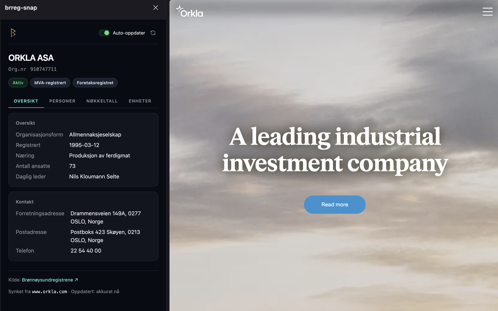

# brreg-snap

See which Norwegian company is behind the site you are on, and whether
the register has anything to warn you about.

[](https://addons.mozilla.org/firefox/addon/brreg-snap/)
[](https://chromewebstore.google.com/detail/brreg-snap/mccggmiialopdaaokhakeijmbafhdmli)

brreg-snap is a browser extension for Firefox and Chrome. It looks the
site up in [Brønnøysundregistrene](https://data.brreg.no/) (the
Brønnøysund Register Centre) and answers two questions: who is behind
this site, and are they OK?

## What it does

Click the toolbar button on a shop or company website. The popup shows:

- **The answer.** A quiet band when the register has no warnings
  («Ingen varsler i registeret»), a firmer band for a warning, and a
  stamp for bankruptcy, deletion, forced dissolution, or a site that
  claims a company it isn't registered for. No warnings is not a
  guarantee that a shop is safe.
- **Kobling:** how the site relates to the company. It can be the
  company's registered website, an organisation number found in the
  page address or title, or only a name match.
- **The ledger:** status, age, employees and the latest filed accounts
  (revenue and result), plus the company's konsern (group) if it has
  one.

The sidebar (Firefox) or side panel (Chrome) goes deeper, with tabs
for Oversikt, Personer (roles), Økonomi (latest accounts, the annual
report PDFs and announcements) and Enheter (group structure and
sub-units). Registry notes (påtegninger) and recent changes show above
the tabs.

Other ways in:

- Search by name or organisation number from the popup or the panel.
- Select text on a page and choose «Slå opp «…» i brreg-snap» in the
  right-click menu.
- Keyboard shortcuts: Alt+Shift+O opens the popup, Alt+Shift+S the
  panel (Control+Shift on macOS). The browser lets you rebind them.

When several companies fit the site equally well, a picker lets you
choose instead of the extension guessing. A wrong match can be
replaced and the choice forgotten. The toolbar button shows «!» for a
warning and «✕» for a stamp on the tab you looked up. «Auto-oppdater»
(off by default) lets an open panel follow your active tab.

On install, a welcome page opens once to show how to use it. It makes
no network request.



## Security model

The extension never injects code into the pages you browse and never
reads their DOM: it has no content scripts. The only server it talks
to is `data.brreg.no`.

| Permission | Why |
|---|---|
| `activeTab` | Read the current tab's address and title, **only when you click the button or the sidebar icon, use a right-click item or press a shortcut** |
| `storage` | Cache brreg responses for 24 hours in `storage.session` (cleared when the browser closes), keep your 5 most recent companies there, and store the «Auto-oppdater» setting in `storage.local` |
| `menus` (Firefox) / `contextMenus` + `sidePanel` (Chrome) | The right-click items, and the side panel on Chrome |
| `host_permissions: https://data.brreg.no/*` | The public brreg API. The only host |
| `optional_permissions: tabs` | **Off by default and not in the install dialog.** Requested only when you turn on «Auto-oppdater» in the panel and confirm the notice about what will be sent. Turning it off gives the permission back |

On Chrome, only the `data.brreg.no` host permission shows an install
warning. `tabs` appears as "Read your browsing history" when you opt
in.

What this rules out:

- No `<all_urls>`, `cookies` or `webRequest`
- No content scripts and no DOM access on the pages you visit
- No `eval`, no `Function()`, no remote code, and a strict CSP
  (`default-src 'self'`, `connect-src https://data.brreg.no`)
- No runtime dependencies: the package holds only the extension's own
  code
- No analytics, trackers or telemetry

`tests/manifest.test.ts` pins the permissions, hosts, CSP and data
declarations, so a change that adds a host, a content script or a
permission fails `pnpm verify`.

## Privacy

To find the company, the extension sends data.brreg.no the site's
registrable domain (`dnb.no` on `nettbank.dnb.no`) and its main word,
an organisation number, or text you search for or select and look up.
It never sends the full page address, the page title or cookies. IP
addresses and reserved local names (`localhost`, names without a dot,
endings like `.local` or `.lan`) are never sent; other names that only
work on a private network are looked up like any other site. Nothing
goes to the developer. Firefox declares this as `browsingActivity`
data collection, the Chrome Web Store as web history.

[PRIVACY.md](PRIVACY.md) has the details: what is sent and when, and
what is stored on your device.

Support: [sebastian@nuez.no](mailto:sebastian@nuez.no) or a GitHub
issue.

## Develop

Requires Node (version range in `package.json` `engines`),
[pnpm](https://pnpm.io/), and Firefox and/or Chrome.

```bash
pnpm install
pnpm dev        # build + launch a Firefox profile with the extension
pnpm verify     # the full gate: typecheck, lint, tests, both builds
```

- [BUILD.md](BUILD.md): reproducible builds, for store reviewers too
- [docs/release.md](docs/release.md): releasing and store publishing
- [docs/notes/platform.md](docs/notes/platform.md): Firefox and Chrome
  differences
- [AGENTS.md](AGENTS.md): guidance for coding agents

Open an issue before a non-trivial change. PRs that add content
scripts, add hosts or relax the CSP will be closed.

GitHub Releases carry the unsigned build artifacts and the source zip
for each tag. They are not an install channel: install from the
stores.

## License

[MIT](LICENSE).

The bundled typeface Schibsted Grotesk (Bakken & Bæck / Schibsted) is
licensed under the [SIL Open Font License 1.1](public/fonts/OFL.txt).
