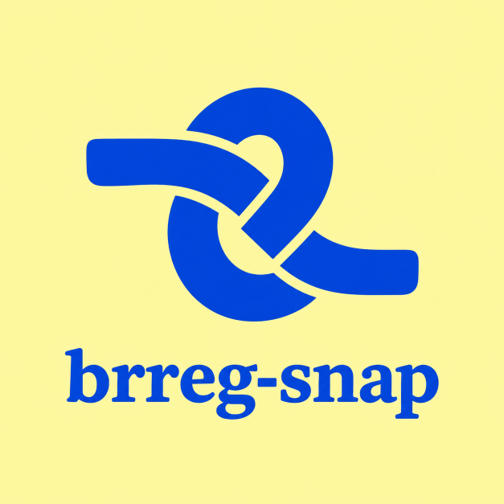
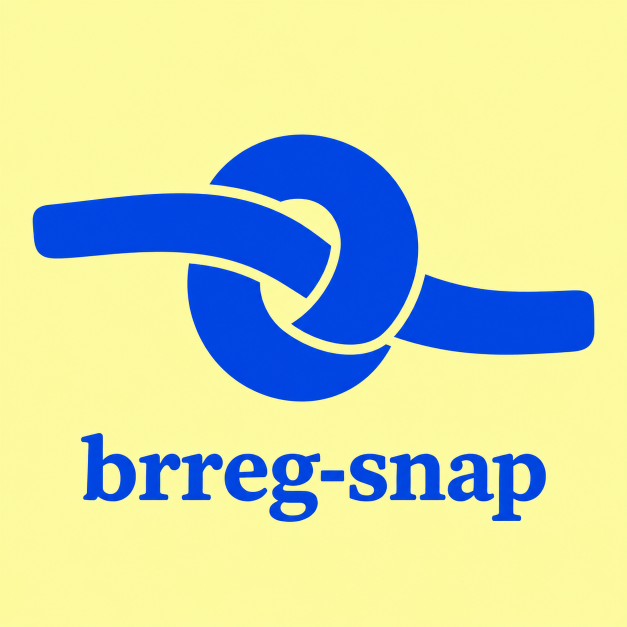
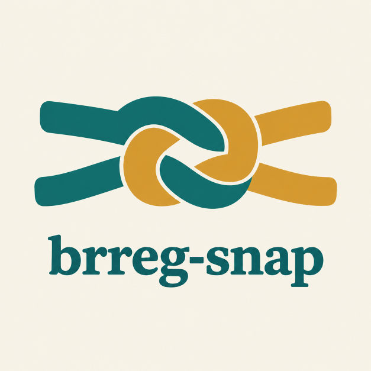
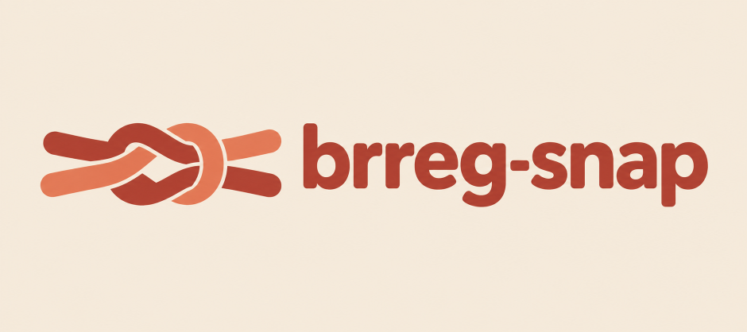
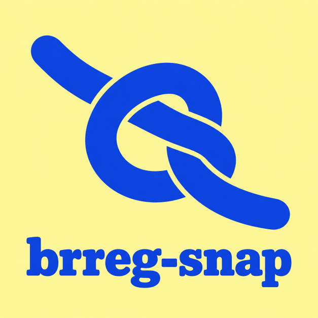

# Logo exploration

Status: exploring, nothing decided. The shipped mark is unchanged (the
angular bronze B in `public/icons/`). The plan's decision on the new
logo points here.

## Direction: the knot

A knot ties a website to the real company behind it, the link the
product calls «Kobling». It came out of a free-rein round (no concept
given) and was the only direction of about 50 generated candidates the
maintainer wanted to pursue.

## Shortlist

| Image | What it is | Maintainer's verdict |
|---|---|---|
|  | The free-rein candidate that started the direction: one cobalt ribbon, slab-serif wordmark, butter-yellow ground | The look is right and beats the current logo; the knot is physically impossible; colours undecided |
|  | Same style, redrawn as an overhand knot | Good, but a bit too circular |
|  | A reef knot of two strands: teal for the website, ochre for the company | OK; colours undecided |
|  | Reef knot left of a sans wordmark, brick and coral | Decent, but the left side doesn't read as a knot |
|  | Overhand knot drawn from a written spec, no reference image | OK knot |

The images are halved from the generated 1254 px originals.

## What the rounds taught

- **Image models can't draw a real knot.** Neither ChatGPT's image tool
  nor Gemini produced reliably correct over/under crossings, and given
  the origin image as reference they copied its impossible shape. Use
  generated images to choose the look; draw the knot itself as vector.
- **Exploration briefs carry no production constraints.** A first round
  that demanded 16 px legibility, a two-colour palette and flat shapes
  returned nothing but a letter or a check in a container. Brief the
  product and the intent, and apply size and palette limits only when
  refining a chosen concept.
- **Mix guided and free-rein prompts.** Free rein found the knot, but it
  also converges: three of three free ChatGPT runs drew the same peeled
  facade.

## Next steps

1. Decide: one strand or two (website + company), the palette, the
   wordmark (slab serif or sans), and stacked or horizontal lockup.
2. Draw the chosen knot as SVG with correct crossings, plus a simplified
   variant for 16 px and a dark-theme variant.
3. Generate `public/icons/` from the SVG. Today
   `scripts/generate-icons.mjs` downsamples a local, untracked PNG, and
   the repo has no SVG rasterizer yet: pick one.
4. Follow-ups: the `--brand` token in `src/styles/brreg.css`, the store
   listings and the README.

## Prompts

The image prompts were written by the image model's relay from a short
brief (what brreg-snap is, plus a concept or free rein). Three worth
reusing, edited only to drop mentions of a local reference image:

<details><summary>The origin (free rein)</summary>

```text
Use case: logo-brand
Asset type: original logo candidate for brreg-snap, a free Norwegian Firefox and Chrome extension.
Brand context: One click on any website identifies the company behind it in Brønnøysundregistrene, Norway's public business register, and shows its status, leadership, accounts and warnings. For ordinary people and professionals. Independent, free, no tracking, no accounts, no ads. The mark conveys tracing evidence, not certifying that every company is trustworthy.
Primary request: Invent a distinctive logo around "the source knot": a single thick continuous ribbon that makes one compact, asymmetric interlock, like a modern printer's provenance mark. Two open ends enter from different directions and visibly connect through one intelligible crossing. It is an emblem of following a website back to an accountable public record, a connection that can be traced with your eye. Distill the logic of a knot into a bold two-dimensional mark with one precisely placed negative-space break at the crossing. Make its silhouette surprising and memorable, warm and practical, rather than ornamental. Avoid a standard chain link, infinity sign, Celtic knot, pretzel or rounded app icon. This is an original piece of graphic invention, not an illustration of rope.
Style/medium: flat solid-color graphic logo, confident slightly organic curves and blunt terminals, subtle asymmetry, beautifully balanced mass and negative space. A contemporary civic utility with the character of a maker's stamp. Bold enough to read at browser-toolbar scale.
Color palette: a single saturated cobalt blue on a plain pale butter-yellow background. No secondary mark color.
Composition/framing: one finished logo only, centered on a spacious square canvas. Place the standalone emblem above the lowercase wordmark. Give the symbol visual priority and generous empty space. No enclosing badge or container.
Text (verbatim): "brreg-snap". Exact spelling b-r-r-e-g hyphen s-n-a-p. A carefully crafted lowercase sturdy serif wordmark with short, softly flared serifs and open counters, contemporary and readable rather than antique. The text uses the same cobalt blue as the emblem. No other text.
Constraints: no letters hidden in the symbol, no generic letter-in-a-shape mark, no shield, checkmark, magnifying glass, eye, cursor, lightning bolt, flag, government seal, clip-art, stock icon, or imitation of an existing brand. No folded corners or peeled surfaces. No mockups, presentation board, alternative versions, gradients, textures, shadows, outlines, 3D or watermark. Deliver a clean polished logo candidate, not a sketch.
```

</details>

<details><summary>One strand, overhand knot from a written spec (knot-seaman.png)</summary>

```text
Use case: logo-brand
Asset type: standalone logo candidate for brreg-snap, a free Norwegian browser extension that links a website to the real registered company behind it.
Primary request: create one centered logo with a physically correct, loose OVERHAND KNOT made from one continuous thick flat ribbon, above the lowercase wordmark.
Knot construction: use the familiar real sailor's overhand stopper knot, not an abstract knot-like emblem. The standing end enters from upper left. Form a loop by taking the working strand over the standing strand; lead the working end around behind the standing strand, then pass it through the original loop and let the working end exit toward lower right. Show the canonical loose three-crossing overhand-knot projection. Tracing the continuous ribbon from its upper-left end to its lower-right end encounters the crossings in alternating over, under, over, under, over, under order. Every underpass must visibly continue on the other side with consistent width and direction. There are exactly two exposed rounded ends, no branching, no broken strands, no invented extra loop. Keep the knot loose enough that its real structure can be traced.
Style/medium: bold flat-color graphic logo, very broad chunky ribbon, soft rounded bends and rounded terminal ends, crisp clean edges. Separate an underpassing ribbon from the overpassing ribbon with a narrow background-colored clearance. No outlines, shading, gradients, texture or 3D.
Composition/framing: square canvas, generous clear margins; knot centered in upper two thirds, friendly heavy lowercase slab-serif wordmark centered beneath it. Wordmark has soft bracketed slab serifs, substantial stems, open counters and a readable double-storey g. Balanced spacing, broad horizontal wordmark.
Color palette: saturated royal blue #1645D9 for ribbon and wordmark, pale warm yellow #FFF6A0 background.
Text (verbatim): "brreg-snap"
Constraints: one logo only. Spell b r r e g - s n a p exactly. All text lowercase. Prioritize genuine knot topology over symmetry.
Avoid: impossible crossings, fused strands, disconnected crescents, infinity-symbol shortcut, ornamental extra knots, rope fibers, nautical clip art, flags, shields, checkmarks, captions, watermarks, mockups.
```

</details>

<details><summary>Two strands, reef knot (knot-two-strands.png)</summary>

```text
Use case: logo-brand
Asset type: one standalone logo candidate for brreg-snap, a free independent Norwegian browser extension that links a website to its real registered company.
Scene/backdrop: plain warm off-white #F5F1E7.
Primary request: draw a physically correct REEF KNOT, also called a SQUARE KNOT, tied from TWO separate broad ribbons of equal width, one deep teal #126B68 for the website and one golden ochre #D69C32 for the company. It means the product's "Kobling", the link between website and company.
Knot geometry: use the actual standard reef knot made by right-over-left then left-over-right, two opposite-handed half-knots, snugly dressed. Viewed from above, it has two interlocked opposing U-shaped bights: the teal ribbon's standing part and short tail BOTH emerge to the left; the ochre ribbon's standing part and short tail BOTH emerge to the right. Exactly four rounded free ends in total. Each colour is one continuous ribbon with exactly two ends; no colour change, branches, splices, closed rings, or extra ends. At each interlocking bight one leg passes over and the other under the opposing ribbon, exactly as in a real reef knot. Leave enough space to trace the paths. Think of an actual knot tied with two differently coloured strips of fabric before stylizing its outline. Do not substitute two chain links, a granny knot, or an abstract infinity mark.
Style/medium: clean graphic logo, broad chunky flat ribbons, softly rounded ends, smooth bends. Small clean background-coloured gaps at underpasses make the over/under order legible. Minimal fold shading only, no photorealistic fabric texture or ornamental effects.
Composition/framing: square canvas; one centered compact knot above the wordmark, with generous clear space. Keep the mark simple enough for a browser extension identity.
Text (verbatim): "brreg-snap", all lowercase, b r r e g - s n a p, on one line. Friendly heavy slab-serif with rounded slab terminals, in deep teal.
Constraints: one logo only, no other text, no slogan, no annotation, no arrows, no watermark, no mockup. Correct physically tieable knot topology is the main requirement; do not sacrifice it for symmetry.
```

</details>
